# Data-analysis
실제 데이터를 활용한 데이터 분석

 

## 프로젝트 순서
|프로젝트 제목|구성원|기간|내용요약|
|------|---|---|---|
|electronic_car_data|개인|23.10.24(1일)|서울시 전기차 충전소 충전량 데이터를 활용한 충전종료시각 예측|
|sangil_dong_commercial_analysis|4인|23.10(3일)|서울 강동구 상일동 상권 분석|

 

## 1. 서울시 전기차 충전소 데이터 예측
> 서울시 전기차 충전소 충전량 데이터를 활용한 EDA 분석 시각화 충전종료시각 예측을 위한 pycaret 사용
- 데이터: [서울 열린데이터광장 서울시 전기차 충전소 데이터](https://data.seoul.go.kr/dataList/OA-22249/F/1/datasetView.do)

- 목적
  - 종료시각예측을 통해 실제 차량의 대기시간을 예상하고 유동 흐름을 조절 할 수 있는지 확인

- 현배터리양 columns 생성
  - 충전량을 100.0 = 100%로 두고 "충전하기 직전 차에 남아있던 전기량"을 추가
  - 현배터리양 = 100 - 충전량

 
- 충전량 분포 확인  
  |box plot|dist plot|
  |------|---|
  |box 외 100%가 넘어간 부분 제거 필요|Positive skew   극단적인 큰 outlier 존재  |
  |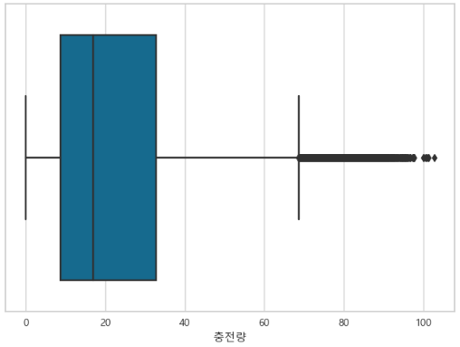 </img>|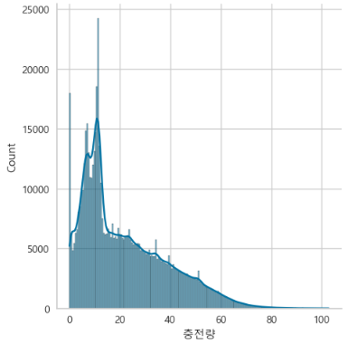 </img>|
  
 
- 학습전 최종 데이터
  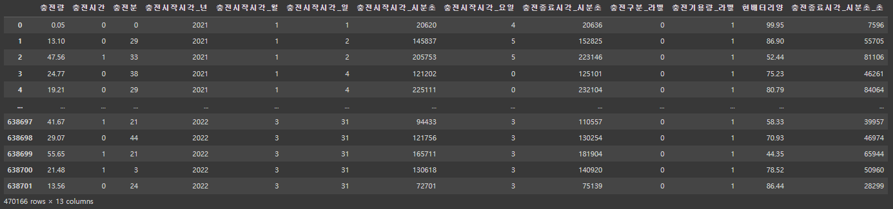 </img>

- Pycaret Model
  - **상위 5개의 모델을 각 blending 및 stacking 하여 결과 확인**

- 결과
  |blender|stacker| 
  |---|---|
  |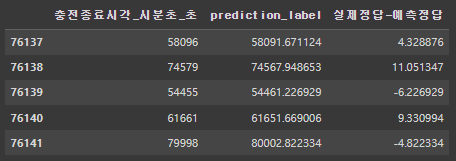 </img>|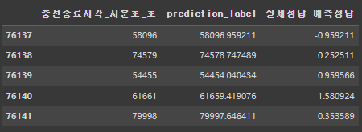 </img>|

  
- 예측 결과 시각화
  |blender|stacker| 
  |---|---|
  |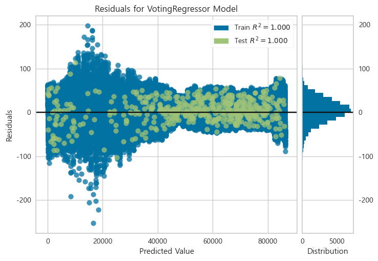 </img>|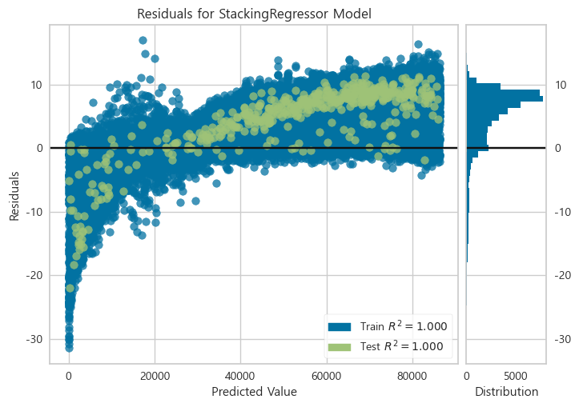 </img>|
  |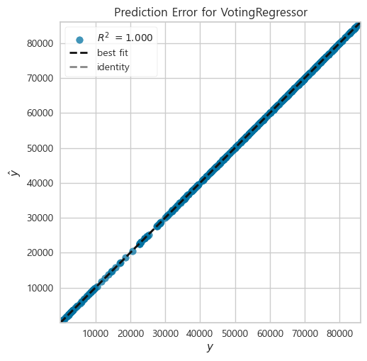 </img>|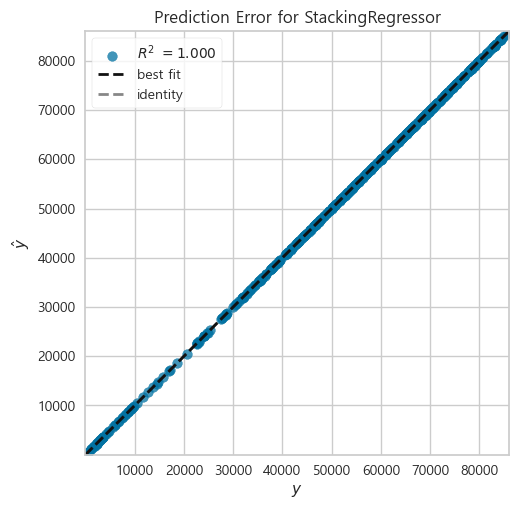 </img>|
  |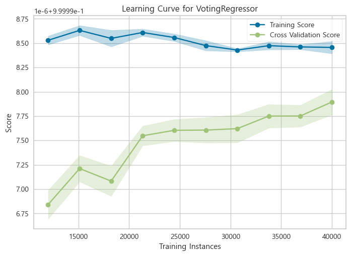 </img>|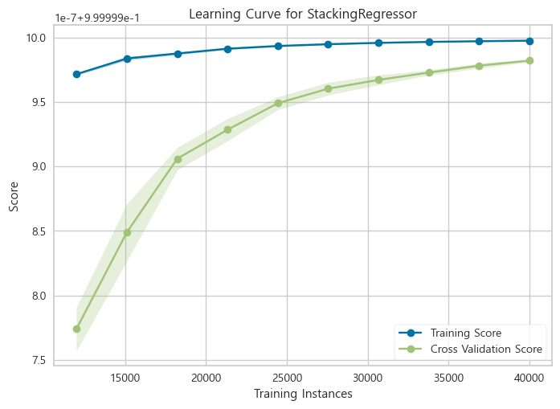 </img>|

 

## 2. 서울 강동구 상일동 상권 분석
> 서울시 상일동 골목상권 EDA 분석 및 시각화
- 데이터: [서울시 상권분석서비스 상일동 골목상권 6개년 데이터](https://data.seoul.go.kr/dataList/OA-15571/S/1/datasetView.do)
  - 기간: 2017-2022년(6개년)

- 목적
  - 골목 상권에 어떠한 영향을 끼쳤는지
  - 상권에서 가장 변화가 큰 업종에 영향을 많이 준 인구통계학 정보를 통해, 재개발로 인한 인구 구성 변화가 어떠했는지 확인 

- 업종별 시계열 매출 변화
  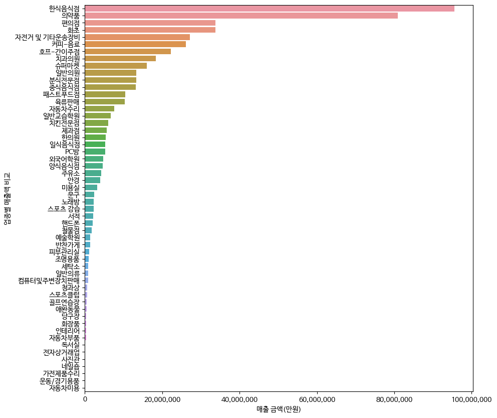 </img>

- 상일동 골목상권 매출 Top10
  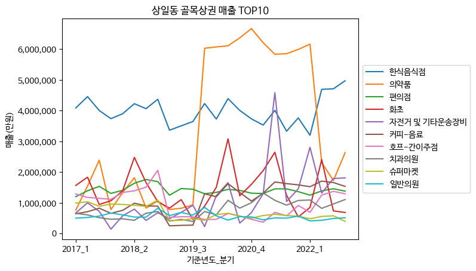 </img>

- 골목상권 추세 
  |병의학 업종|유흥업| 
  |---|---|
  |일반의원이 큰 차이를 보이지 않는 것에 비해 의약품이 크게 상승 후 하락|호프, 슈퍼마켓, 노래방 크게 하락   호프는 코로나 이후 상승|
  |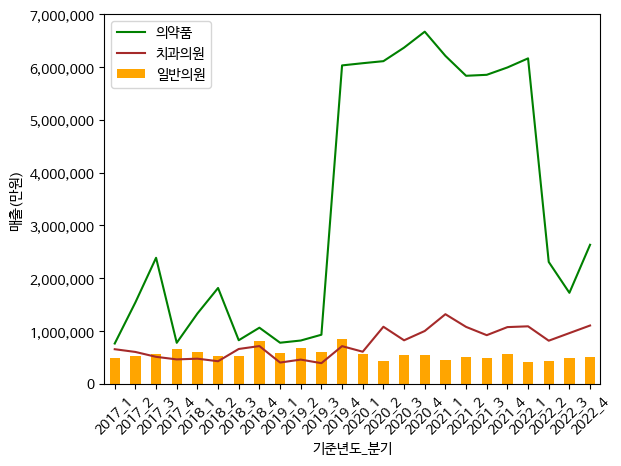 </img>|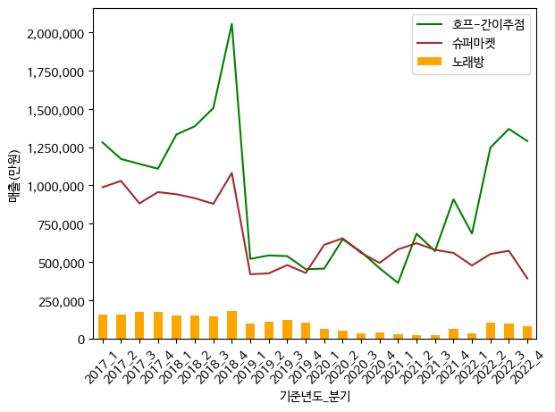 </img>|

  |유사 업종|주기성을 보이는 업종| 
  |---|---|
  |일반교습학원은 코로나 시기에 상승 후 하락   외국어학원은 하락 후 상승|화초, 편의점, 서적|
  |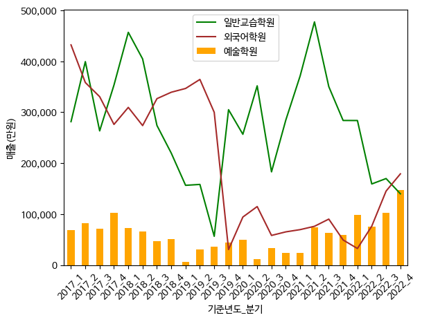 </img>|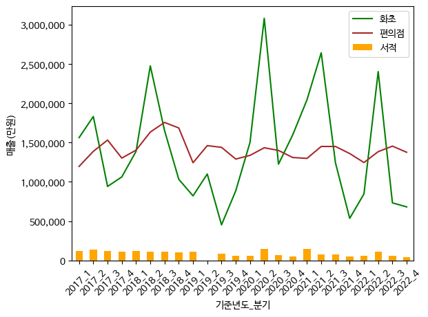 </img>|
 
- 성별 간 매출변화
  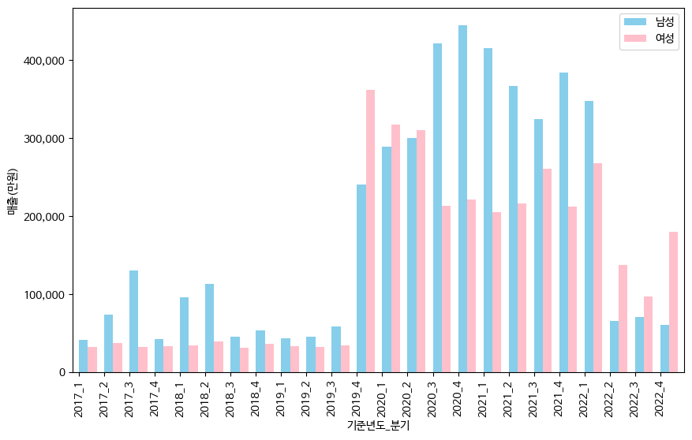 </img>

- 연령 별 세분화(line plot)
  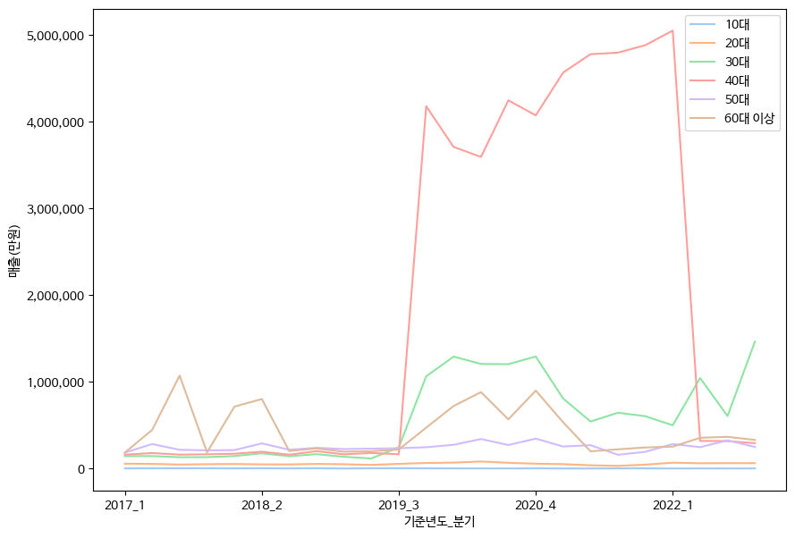 </img>

- 연령 별 세분화(pie chart)
  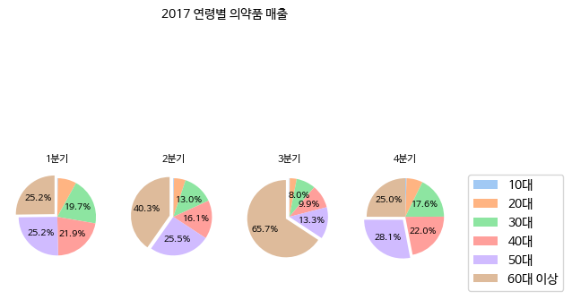 </img>
  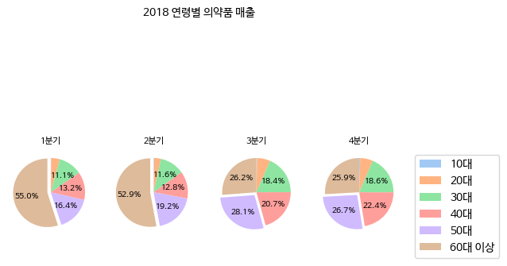 </img>
  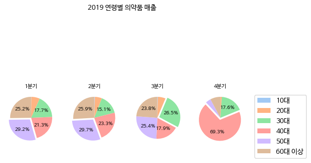 </img>
  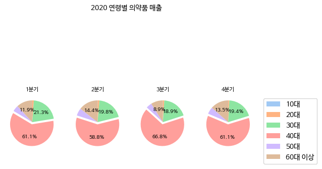 </img>
  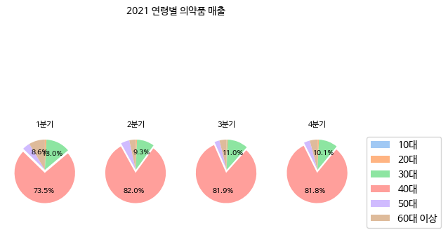 </img>
  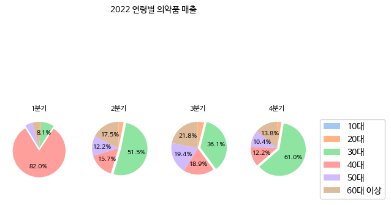 </img>
